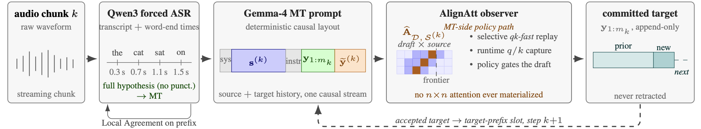
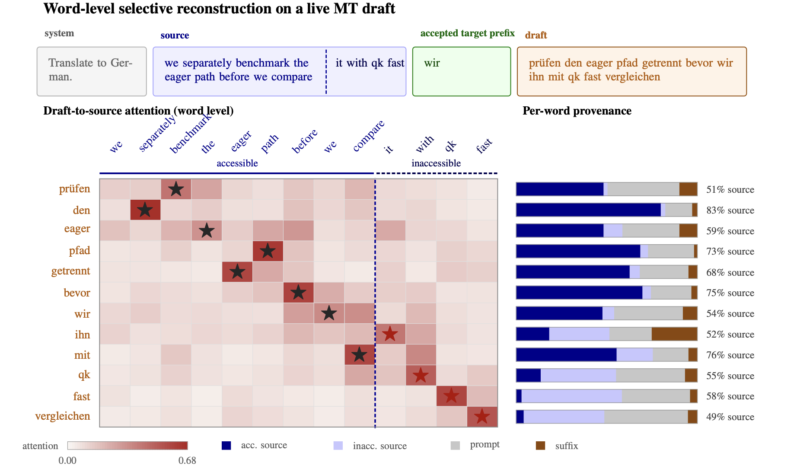
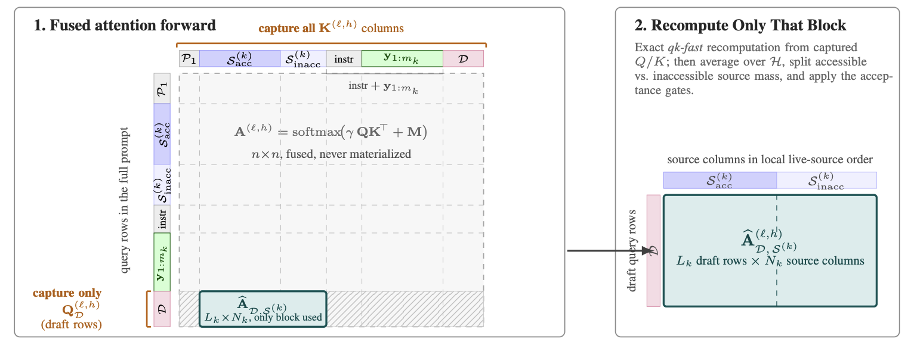
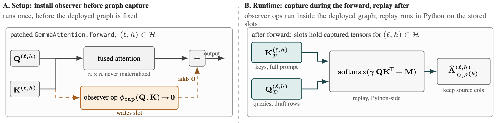

<h1 align="center">
  
  AlignAtt4LLM
</h1>

> [AlignAtt4LLM: Fast AlignAtt for Decoder-Only LLMs at IWSLT 2026
> Simultaneous Speech Translation Task](https://arxiv.org/abs/2606.03967)

**AlignAtt4LLM** adapts [AlignAtt](https://arxiv.org/abs/2305.11408) to decoder-only LLMs for simultaneous speech
translation. The MT model drafts a translation from the current source prefix,
the runtime reconstructs target-to-source attention from selected decoder
attention heads, and only the target prefix that is supported by accessible
source evidence is emitted.




## Scope & what it brings ?

The IWSLT implementation is end-to-end: it includes ASR, chunk-synchronous runtime code (synchronicity comes from the requirement to use [SimulStream](https://arxiv.org/abs/2512.17648)), and MT. This makes the full
ASR + MT cascade runnable from audio input to simultaneous translation output. But the core of the innovation here is what happens in the MT part:

**1.** The idea of reconstructing the attention, to know *where to cut* :




**2.** The way of recomputing attention from a fused kernel to keep inference *fast*




**3.** The way of capturing keys and queries at runtime in [VLLM](https://github.com/vllm-project/vllm) to keep inference *really fast*




**Thus, this package contains:**

- a reproducible end-to-end cascade
- A focus on the implementation of AlignAtt to decoders only LLMs.

## Quickstart:

```bash
uv venv .venv-dev --python 3.13
UV_PROJECT_ENVIRONMENT=.venv-dev uv sync --group dev
.venv-dev/bin/python -m pytest
```

## Quickstart: A100 Inference

```bash
tools/bootstrap/setup_inference_qwen_asr_vllm.sh
```

Then run one local WAV:

```bash
.venv-inference/bin/alignatt-compare --wav <local.wav>
```

Run a batch point:

```bash
.venv-inference/bin/alignatt-batch \
  --inputs <local.wav> \
  --target zh \
  --mt-backend-name milmmt_vllm_alignatt \
  --translation-alignatt-top-k-heads 8 \
  --output-dir outputs/milmmt_zh_smoke
```

Score an output directory:

```bash
.venv-evaluation/bin/alignatt-eval \
  --output-dir outputs/milmmt_zh_smoke
```

## Public CLI

- `alignatt-batch` — run the streaming cascade over one or more media files.
- `alignatt-eval` — score emitted hypotheses with OmniSTEval-compatible files.
- `alignatt-gemma-asr` — standalone Gemma AlignAtt ASR probe.

## Documentation

- [Architecture](docs/architecture.md)
- [Generalizing AlignAtt4LLM to other LLMs](docs/generalizing.md)
- [Data](docs/data.md)
- [Reproducibility](docs/reproducibility.md)
- [Results](docs/results.md)
- [Development](docs/development.md)

## Citation

```bibtex
@article{fuxa2026alignatt4llm,
  title = {AlignAtt4LLM: Fast AlignAtt for Decoder-Only LLMs at IWSLT 2026 Simultaneous Speech Translation Task},
  author = {Fuxa, Quentin and Macháček, Dominik},
  year = {2026},
  doi = {10.48550/arXiv.2606.03967},
  url = {https://arxiv.org/abs/2606.03967}
}
```
