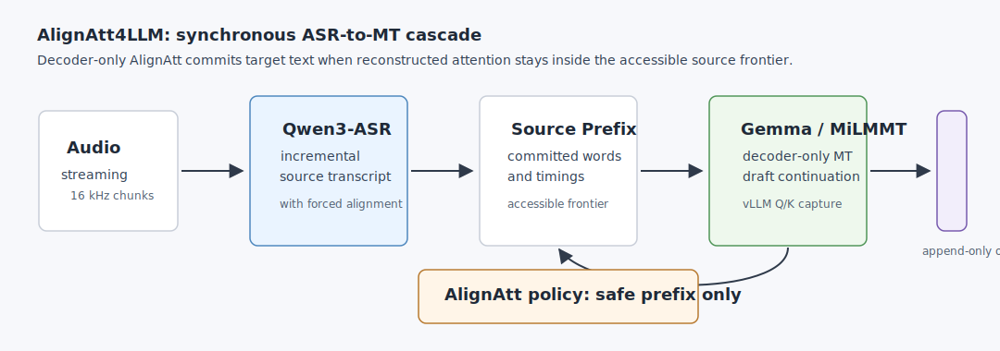

# AlignAtt4LLM

[](LICENSE)
[](https://arxiv.org/abs/2606.03967)

Research code for **AlignAtt4LLM**, the IWSLT 2026 simultaneous speech
translation system described in:

> [AlignAtt4LLM: Fast AlignAtt for Decoder-Only LLMs at IWSLT 2026
> Simultaneous Speech Translation Task](https://arxiv.org/abs/2606.03967)



## What This Repo Contains

- A streaming ASR-to-MT cascade for simultaneous speech translation.
- Qwen3-ASR forced-alignment and Gemma-family vLLM runtime glue.
- Decoder-only AlignAtt policy code, calibrated attention-head artifacts, and
  evaluation/reporting utilities.
- Compact score anchors and reproducibility notes for the public paper.

The repo does **not** vendor model weights, dataset audio, Docker submission
packaging, or paper LaTeX/PDF sources. The paper lives on arXiv.

## Quickstart: Inspect And Test

```bash
uv venv .venv-dev --python 3.13
UV_PROJECT_ENVIRONMENT=.venv-dev uv sync --group dev
.venv-dev/bin/python -m pytest
```

This path exercises the maintained policy/runtime tests without loading GPU
models.

## Quickstart: A100 Inference

```bash
tools/bootstrap/setup_inference_qwen_asr_vllm.sh
```

Then run one local WAV:

```bash
.venv-inference/bin/alignatt-compare --wav <local.wav>
```

Run a batch point:

```bash
.venv-inference/bin/alignatt-batch \
  --inputs <local.wav> \
  --target zh \
  --mt-backend-name milmmt_vllm_alignatt \
  --translation-alignatt-top-k-heads 8 \
  --output-dir outputs/milmmt_zh_smoke
```

Score an output directory:

```bash
.venv-evaluation/bin/alignatt-eval \
  --output-dir outputs/milmmt_zh_smoke
```

## Public CLI

- `alignatt-batch` — run the streaming cascade over one or more media files.
- `alignatt-compare` — run single-audio ASR/backend comparisons.
- `alignatt-eval` — score emitted hypotheses with OmniSTEval-compatible files.
- `alignatt-preset` — run named runtime presets.
- `alignatt-gemma-asr` — standalone Gemma AlignAtt ASR probe.
- `alignatt-mt-parity` — MT backend parity and prompt probes.

## Repo Map


- `src/alignatt4llm/` — maintained runtime package.
- `src/alignatt4llm/cli/` — stable public command entrypoints.
- `tests/` — maintained regression and policy tests.
- `tools/research/` — experiment launchers and calibration utilities.
- `tools/reports/` — offline reporting, plotting, and replay utilities.
- `tools/bootstrap/` — local environment setup helpers.
- `data/` — tracked references, AlignAtt head payloads, and small fixtures.
- `docs/` — architecture, data, reproducibility, and result notes.

## Documentation

- [Architecture](docs/architecture.md)
- [Data](docs/data.md)
- [Reproducibility](docs/reproducibility.md)
- [Results](docs/results.md)
- [Development](docs/development.md)

## Citation

```bibtex
@article{fuxa2026alignatt4llm,
  title = {AlignAtt4LLM: Fast AlignAtt for Decoder-Only LLMs at IWSLT 2026 Simultaneous Speech Translation Task},
  author = {Fuxa, Quentin and Machacek, Dominik},
  year = {2026},
  doi = {10.48550/arXiv.2606.03967},
  url = {https://arxiv.org/abs/2606.03967}
}
```

## License

Code in this repository is released under the MIT License. See [LICENSE](LICENSE).
