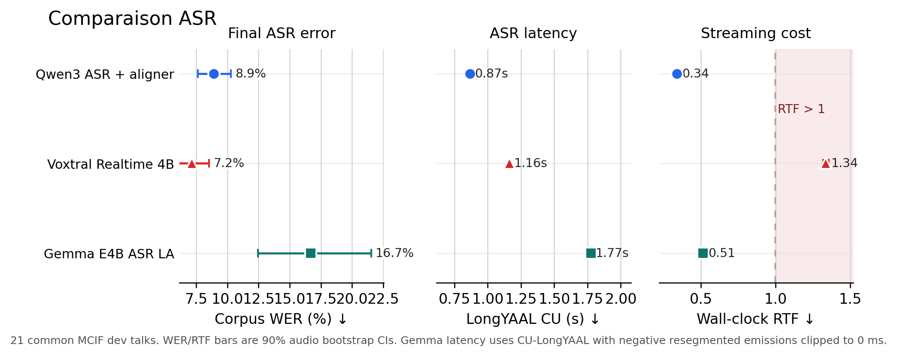

# Comparaison ASR

This note documents the data behind the ASR comparison figure used to decide
which ASR backend to keep in the simultaneous cascade.

## Bottom line

Qwen remains the clean default. Voxtral improves final ASR WER, but the retained
streaming setting is slower in LongYAAL and is above the real-time wall-clock
boundary. Gemma E4B is faster than Voxtral in wall-clock RTF, but the current
local-agreement probe is not quality-safe: it has much worse WER and leaks the
ASR prompt into the transcript on long talks.

For the directly plotted comparison:

| ASR backend | Corpus WER | LongYAAL CU | Mean RTF | Notes |
|---|---:|---:|---:|---|
| Qwen3 ASR + Forced Aligner | 8.91% | 0.87 s | 0.34 | Current stable default |
| Voxtral Realtime 4B, 480 ms | 7.15% | 1.16 s | 1.34 | Better WER, but not real-time |
| Gemma E4B ASR local agreement | 16.69% | 1.77 s | 0.51 | Prompt leak; diagnostic clipped latency |

Interpretation: Voxtral buys `-1.75` WER points vs Qwen, but costs `+0.30 s`
LongYAAL CU and `3.94x` wall-clock RTF. Gemma loses `+7.79` WER points vs Qwen.
The `1.77 s` Gemma latency is not a paper-clean latency measurement; it is a
diagnostic correction of a broken raw score. The apparent raw Gemma LongYAAL is
not defensible because prompt-leak words are resegmented with negative emission
delays.

## Current figure



Generated files:

- `comparaison_asr.png`
- `comparaison_asr.svg`
- `outputs/comparaison_asr/comparaison_asr.png`
- `outputs/comparaison_asr/comparaison_asr.svg`
- `outputs/comparaison_asr/comparaison_asr_summary.tsv`
- `outputs/comparaison_asr/comparaison_asr_summary.json`

## Data sources

Qwen:

- Aggregate/per-audio ASR metrics:
  `outputs/asr_compare_enen_21audio_20260421/qwen_forced__summary.json`
- Per-audio run JSONs:
  `outputs/asr_compare_enen_21audio_20260421/qwen_forced/*.json`
- Existing LongYAAL evaluation:
  `outputs/asr_compare_enen_21audio_20260421/qwen_forced_eval/evaluation.json`

Voxtral:

- Aggregate WER/CER/RTF:
  `/home/fuxa/iwslt-2026-baselines/precomputed_asr_voxtral/voxtral_wer_cer_results.json`
- Retained realtime traces:
  `/home/fuxa/iwslt-2026-baselines/precomputed_asr_voxtral/<talk_id>/delay480ms/asr_chunks.jsonl`
- LongYAAL evaluation generated from retained `delay480ms` traces:
  `outputs/comparaison_asr/voxtral_delay480_eval/evaluation.json`

The Voxtral metadata identifies the model as
`mistralai/Voxtral-Mini-4B-Realtime-2602`.

Gemma:

- Direct local-agreement ASR capture, without AlignAtt/QK observer:
  `outputs/gemma_e4b_asr_mcif_la_full_20260424/`
- Per-talk captures:
  `outputs/gemma_e4b_asr_mcif_la_full_20260424/captures/*.json`
- Aggregate WER/CER/RTF manifest:
  `outputs/gemma_e4b_asr_mcif_la_full_20260424/manifest.json`
- LongYAAL evaluation:
  `outputs/gemma_e4b_asr_mcif_la_full_20260424/eval/evaluation.json`
- Re-segmented instances used for the clipped-latency sanity check:
  `outputs/gemma_e4b_asr_mcif_la_full_20260424/eval/instances.resegmented.jsonl`

## Metric definitions

- `Corpus WER`: word-error rate weighted by reference word count over the 21
  common MCIF dev talks.
- `Mean WER`: unweighted average of per-talk WER.
- `Mean RTF`: unweighted average of per-talk wall-clock real-time factor from
  the stored ASR metrics.
- `LongYAAL CU`: compute-unaware latency from OmniSTEval.
- `LongYAAL CA`: computation-aware latency from OmniSTEval.
- Confidence intervals: 90% audio-level bootstrap intervals.

For Voxtral LongYAAL CU, the retained `delay480ms` traces were converted to
OmniSTEval hypothesis format by assigning each final word to the first
`audio_seconds` chunk where it appears in the exact final prefix. Words not
recoverable from exact-prefix appearances are conservatively emitted at EOS.
This affected 16 / 16,307 words (`0.10%`).

Important caveat: Voxtral WER/CER/RTF are available for 240/480/960 ms in the
aggregate JSON, but retained streaming traces are only present for `delay480ms`.
Therefore LongYAAL CU is computed only for Voxtral 480 ms, not for 240/960 ms.

## Aggregate table

| Method | Corpus WER | Mean WER | Mean CER | Mean RTF | RTF 90% CI | WER 90% CI | Delta WER vs Qwen | RTF ratio vs Qwen | Wins/losses vs Qwen | LongYAAL CU | LongYAAL CA |
|---|---:|---:|---:|---:|---:|---:|---:|---:|---:|---:|---:|
| Qwen3 ASR + Forced Aligner | 8.91% | 9.17% | 4.22% | 0.340 | [0.327, 0.353] | [7.62%, 10.27%] | - | - | - | 865.7 ms | 672.7 ms |
| Voxtral Realtime 4B, 240 ms | 7.99% | 8.15% | 3.90% | 1.342 | [1.323, 1.362] | [6.22%, 9.85%] | -0.91 pts | 3.95x | 15 / 6 | - | - |
| Voxtral Realtime 4B, 480 ms | 7.15% | 7.26% | 3.18% | 1.338 | [1.320, 1.357] | [5.82%, 8.53%] | -1.75 pts | 3.94x | 17 / 4 | 1164.0 ms | 1308.2 ms |
| Voxtral Realtime 4B, 960 ms | 6.16% | 6.28% | 2.33% | 1.344 | [1.320, 1.371] | [4.98%, 7.42%] | -2.74 pts | 3.95x | 21 / 0 | - | - |
| Gemma E4B ASR local agreement | 16.69% | 17.22% | 9.66% | 0.515 | [0.496, 0.535] | [12.44%, 21.55%] | +7.79 pts | 1.51x | 2 / 19 | 1774.8 ms | 48.4 ms |

## Gemma investigation

The Gemma run is a direct ASR probe with local agreement:

- script: `scripts/gemma_e4b_asr_local_agreement_capture.py`
- model path: `gemma_model_name` from `cascade.runtime`
- chunk size: `800 ms`
- audio window: up to `30 s`
- no AlignAtt heads, no Q/K observer, no timestamp reconstruction
- local agreement commits whole-word LCPs and reinjects a bounded suffix of the
  stable prefix

The run completed on all 21 MCIF dev talks. It is compute-feasible
(`mean RTF = 0.515`) but not quality-feasible (`corpus WER = 16.69%`).
The worst WER talks were:

| Talk | Gemma WER | Gemma RTF | Main symptom |
|---|---:|---:|---|
| `ERmKpJPPDc` | 58.16% | 0.426 | Prompt instruction becomes committed transcript |
| `JhbtCwcsWY` | 42.78% | 0.445 | Prompt instruction becomes committed transcript |
| `miPjvjWOvI` | 33.03% | 0.490 | Severe ASR drift |

The prompt leak is visible in the captures. On `ERmKpJPPDc`, Gemma repeatedly
generates the ASR instruction inside the hypothesis and commits it by
`audio_processed_s = 163.2`. On `JhbtCwcsWY`, the same failure is committed by
`audio_processed_s = 219.2`. The leaked string includes the instruction
`provide a verbatim word for word transcription ... only output the
transcription with no newlines`.

This also explains the suspicious raw latency. The raw OmniSTEval score for
Gemma is:

| Method | BLEU | chrF | Raw LongYAAL CU | Raw LongYAAL CA | Plotted LongYAAL CU |
|---|---:|---:|---:|---:|---:|
| Qwen3 ASR + Forced Aligner | 74.82 | 90.81 | 865.7 ms | 672.7 ms | 865.7 ms |
| Voxtral Realtime 4B, 480 ms | 77.87 | 91.60 | 1164.0 ms | 1308.2 ms | 1164.0 ms |
| Gemma E4B ASR local agreement | 56.13 | 81.65 | 318.0 ms | 48.4 ms | 1774.8 ms |

The raw Gemma `318.0 ms` LongYAAL CU is not used in the figure. Re-segmentation
assigns prompt-leak fragments to late reference segments with negative emission
delays, including prompt words such as `verbatim`, `only output the
transcription`, and `newlines`. In this run, `22` resegmented instances contain
negative CU emissions, affecting `47` emitted tokens; the most extreme value is
`-176015 ms`.

The figure therefore plots a sanity-corrected Gemma CU score computed from the
same `instances.resegmented.jsonl` after clipping negative `emission_cu` values
to `0 ms`. This avoids rewarding the pathology, but it should still be read as a
diagnostic correction rather than a clean architectural latency measurement.
Other simple sanity variants land in the same broad range:

| Gemma LongYAAL CU variant | Score |
|---|---:|
| Raw OmniSTEval | 318.0 ms |
| Clip negative `emission_cu` to 0 ms | 1774.8 ms |
| Drop instances with any negative emission | 1814.3 ms |
| Drop only negative-emission tokens | 1834.1 ms |

So the defensible conclusion is not that Gemma latency is exactly `1.77 s`.
Rather, the raw `318 ms` is an artifact, and once the negative-emission artifact
is removed Gemma is around `1.8 s` on this evaluation. Because the transcript is
itself degraded by prompt leak and because Gemma local-agreement captures do not
carry real word timestamps, this number should be treated as a diagnostic
lower-confidence point.

This is also why `asr_reference_tail_risk_curve.png` does not latency-shift the
Gemma curve by `1.77 - 0.87 s`. That figure measures local word risk at distance
`d` from the current ASR tail. For Gemma, distance is already a proportional
word-position proxy rather than a timestamped tail distance; adding the
diagnostic LongYAAL shift would mix two approximations and make the curve look
more precise than the evidence supports.

## LongYAAL evaluation scores

| Method | BLEU | chrF | LongYAAL CU used in figure | LongYAAL CA |
|---|---:|---:|---:|---:|
| Qwen3 ASR + Forced Aligner | 74.82 | 90.81 | 865.7 ms | 672.7 ms |
| Voxtral Realtime 4B, 480 ms | 77.87 | 91.60 | 1164.0 ms | 1308.2 ms |
| Gemma E4B ASR local agreement | 56.13 | 81.65 | 1774.8 ms | 48.4 ms |

These BLEU/chrF scores are en-en ASR-to-reference scores from OmniSTEval, not
MT scores.

## Reproduction commands

Compute Voxtral LongYAAL CU from retained traces:

```bash
python3 scripts/eval_voxtral_asr_longyaal.py
```

Evaluate already-captured Gemma ASR traces:

```bash
python3 scripts/eval_gemma_e4b_asr_longyaal.py
```

Regenerate the ASR comparison figure and summary tables:

```bash
python3 scripts/plot_asr_comparison.py
install -m 0644 outputs/comparaison_asr/comparaison_asr.png comparaison_asr.png
install -m 0644 outputs/comparaison_asr/comparaison_asr.svg comparaison_asr.svg
```

## Scripts and helpers

- `scripts/eval_voxtral_asr_longyaal.py`
  - Converts retained Voxtral `delay480ms/asr_chunks.jsonl` traces into
    OmniSTEval ASR hypotheses.
  - Scores LongYAAL CU/CA with `evaluate_cascade_outputs.py --skip-comet`.
- `scripts/gemma_e4b_asr_local_agreement_capture.py`
  - Runs Gemma E4B as a direct ASR probe with local agreement.
  - Does not use AlignAtt heads or attention-derived timestamps.
- `scripts/eval_gemma_e4b_asr_longyaal.py`
  - Converts Gemma captures into OmniSTEval hypothesis format.
  - Writes capture diagnostics and LongYAAL/ASR-to-reference scores.
- `scripts/plot_asr_comparison.py`
  - Loads Qwen, Voxtral, and Gemma aggregate metrics.
  - Adds LongYAAL CU for Qwen, Voxtral 480 ms, and Gemma.
  - Writes `comparaison_asr` figure and machine-readable summaries.

## Suggested paper wording

Voxtral Realtime improves final ASR WER on the dev set, but the gain comes at a
substantial streaming cost. On the 21 common MCIF talks, Voxtral 480 ms reduces
corpus WER from 8.91% to 7.15%, but increases compute-unaware LongYAAL from
0.87 s to 1.16 s and runs above the real-time wall-clock boundary
(`RTF=1.34` vs `0.34` for Qwen). A direct Gemma E4B ASR local-agreement probe
runs below real time (`RTF=0.51`), but degrades corpus WER to 16.69% and leaks
the ASR prompt into long transcripts. We therefore keep Qwen3 ASR in the
simultaneous cascade.
