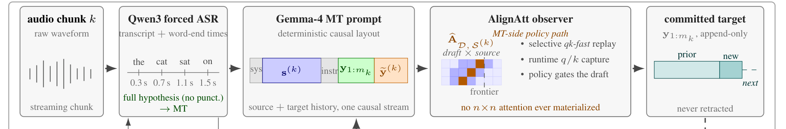
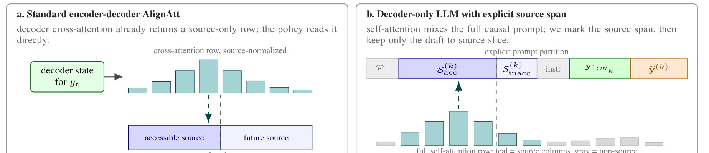
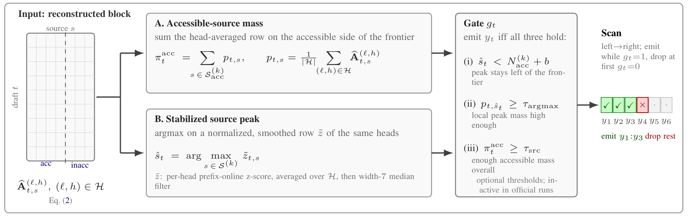
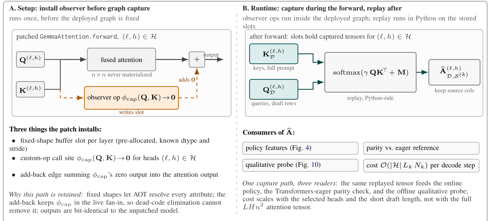

# Architecture

AlignAtt4LLM is implemented as the chunk-synchronous cascade described in the
paper:

1. Qwen3-ASR decodes the growing audio prefix.
2. Qwen3 ForcedAligner assigns word timings to the committed source text.
3. The MT prompt exposes the committed source span explicitly.
4. Gemma-family decoder-only MT drafts a target continuation through vLLM.
5. AlignAtt reconstructs draft-to-source attention and commits only the safe
   target prefix.

## Decoder-Only AlignAtt

Classic AlignAtt uses encoder-decoder cross-attention. Decoder-only LLMs do
not expose that structure, so this runtime reconstructs the needed signal from
the prompt and self-attention:

- the prompt marks the current source span;
- translation-specific attention heads are selected offline;
- q/k replay reconstructs attention from draft tokens to source tokens;
- runtime Q/K capture keeps the vLLM output path bit-identical;
- the policy accepts a target prefix when the selected attention stays within
  the accessible source frontier.

The implementation separates the expensive full attention computation from the
small source block the policy needs. The deployed path captures the required
queries and keys, replays only the draft-to-source block, and applies the same
acceptance rule over the reconstructed rows.

## Main Runtime Pieces

- `alignatt4llm.runtime` owns session state, ASR/MT backend construction, and
  the chunk-by-chunk cascade loop.
- `alignatt4llm.simulstream_processor` exposes the runtime as a SimulStream
  processor.
- `alignatt4llm.mt` implements Gemma-family vLLM MT backends and AlignAtt
  acceptance policies.
- `alignatt4llm.alignment` implements Qwen forced-alignment and Gemma ASR
  research backends.
- `alignatt4llm.cli` contains the public command entrypoints.
