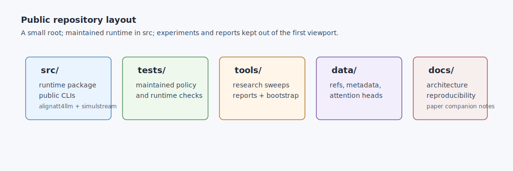

# Development

## Layout



- Runtime code lives under `src/alignatt4llm/`.
- Public CLIs live under `src/alignatt4llm/cli/`.
- Maintained tests live under `tests/`.
- Research utilities live under `tools/research/`.
- Offline reports and plotting utilities live under `tools/reports/`.
- Bootstrap helpers live under `tools/bootstrap/`.

## Local Checks

```bash
python -m compileall src tools tests
python -m pytest
```

## Public API Discipline

The stable user-facing surface is the `alignatt-*` CLI set. Files under
`tools/` are useful for reproducing and extending experiments, but they are not
presented as stable APIs.

Do not reintroduce root-level runners, root-level tests, paper source files, or
Docker submission packaging on this public branch.
